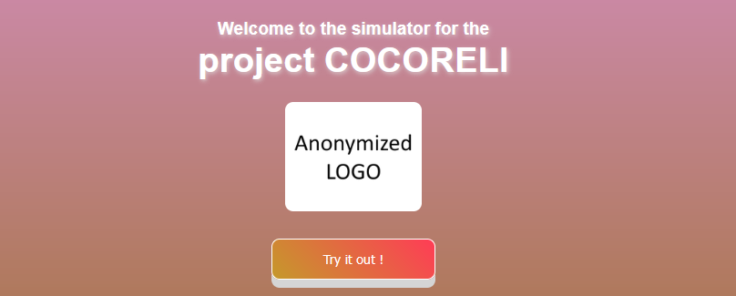
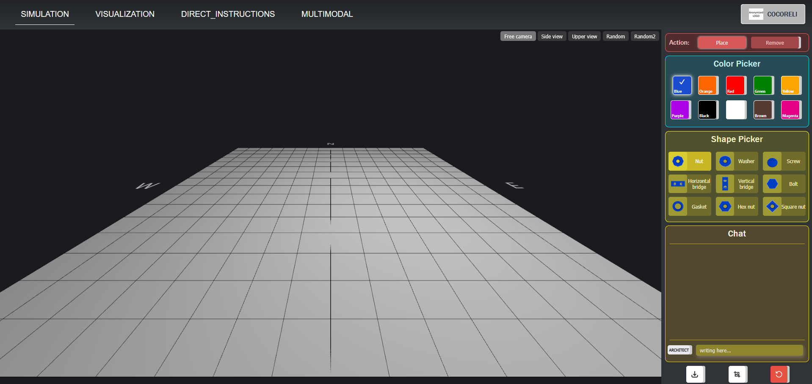

# Cocoreli Simulator

Welcome to Cocoreli simulator

## Installation


Install the required dependencies:

```bash
npm install
```

> **Note:** Make sure there are no warnings during installation for a smooth setup.

## Development

To start the development server and use the simulator, run:

```bash
npm run dev
```

Your application should now be running on [http://localhost:3000](http://localhost:3000).

## Usage



Click on the "Try it out !" Button, it should take around 15s to compile everything the first time then you will access the simulator



In the header, you can select the mode you want. Here are the available modes:

* **Simulation** : Allows you to freely build anything in the environment and download a JSON file of your build.
* **Visualization** : Lets you replay the JSON file of a game you previously created.
* **Direct Instruction** : Enables you to place elements in the environment using functions in the chat, such as:
  * Example:
  * ```
    place("nut", "red", 1, 1, 1)
    place("nut", "red", 1, 1, 2)
    place("nut", "red", 1, 1, 3)
    ```


- **Multimodal** : Generates synthetic image data. Build a structure, and it will produce multiple images of it with different elements in the environment.

## Focus on the simulator

On the right side, you will have access to different sections:

1. **Action** : Choose between placing elements in the environment or breaking placed elements.
2. **Color Picker** : Select the color of the shape you will place.
3. **Shape Picker** : Choose the shape to place in the environment.
4. **Chat** : Communicate with either the architect or the builder. You can switch between them by clicking the white button.

At the bottom, three standalone buttons allow you to:

* Download the JSON logs of the game.
* Take a screenshot of the environment.
* Erase the environment.
